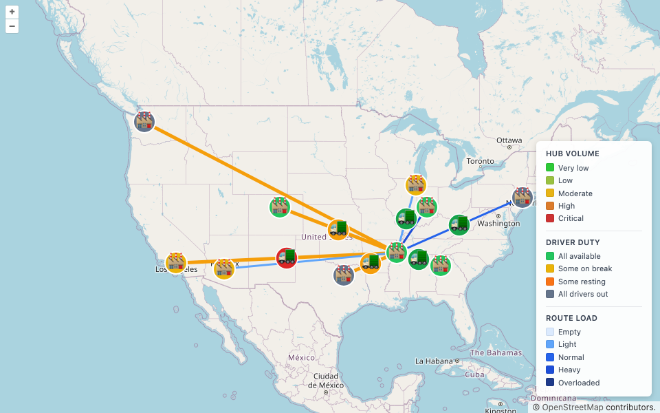
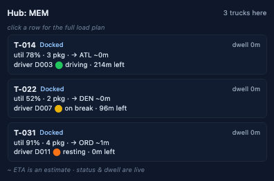

# RFID-Assisted Middle-Mile Trailer Optimization Platform

A logistics optimization MVP for a hub-and-spoke middle-mile truck network. It models
trailers as rear-to-nose ordered load blocks, treats RFID as probabilistic sensor
evidence, and continuously re-optimizes hub-to-hub freight flow to reduce package
rehandling, blocked freight, and missed connections — while keeping trailers well
utilized and **drivers legal under Hours-of-Service (HOS) rules**.

This repository is the **MVP build**: a simulation-driven system with an event-sourced
operational twin, a rolling-horizon optimizer, a realistic time model, full FMCSA
driver Hours-of-Service, and a **realtime USA-map visualization** of trailers, hubs,
drivers, and freight flow.



## Supported Features (v1.0 – v1.2)

The platform is built across three milestones. Everything below is shipped and tested.

### Operational core (v1.0)

- **Event-sourced operational twin** — an append-only Postgres event log with per-stream
  optimistic concurrency, plus pure projection reducers that answer "where is package X"
  and "what is on trailer T". **Deterministic, byte-identical replay** is the keystone:
  the same seed reproduces the exact event stream, guarded by golden-replay tests.
- **Route-aware LIFO load planner** — a custom greedy + local-search planner that builds
  single-rear-door, LIFO-correct trailer load plans (nose→rear by unload order), scored
  for rehandle and utilization. An **independent validator** re-checks every plan against
  the LIFO/blocker rules, so plans are explainable and auditable.
- **Probabilistic RFID validation** — RFID/barcode reads are treated as noisy sensor
  evidence. A sensor-fusion layer produces a confidence-scored location estimate per
  package, and a detector flags **wrong-trailer** and **missed-unload** exceptions
  (PLANNED vs OBSERVED) with a calibrated false-positive rate.

### Rolling optimizer (v1.0)

- **Rolling-horizon re-optimization** — a per-tick epoch loop that scopes the affected
  hubs, respects a freeze window, and re-plans freight flow as conditions change:
  - **min-cost-flow** freight→route-leg assignment (custom successive-shortest-paths),
  - **VRPTW** trailer/truck routing (custom savings/insertion + 2-opt/Or-opt heuristic),
  - **local repair** moves (split / reassign / hold / over-carry) for infeasible trailers,
  - and the optimizer is **HOS-enforced** — it calls the same Hours-of-Service engine the
    simulator does, treating mandatory rest as time, so recommended plans stay legal.

### Realistic time + driver HOS (v1.1 – v1.2)

- **Realistic ORS time model** — per-leg transit medians derived from real great-circle
  distance (≈400 min for the shortest spoke leg to ≈2250 min for the longest), with
  seeded log-normal dwell/transit variance, so the simulated network behaves like a real
  middle-mile operation rather than a flat-time toy.
- **Driver Hours-of-Service (full FMCSA)** — a pure, deterministic HOS engine enforcing
  the headline limits: **11h driving, 14h on-duty window, 30-min break after 8h, 10h
  reset, 70h/8-day cap, 34h restart**, plus the 7/3 and 8/2 sleeper-berth splits. One
  driver is seeded per trailer and assigned per trip; the engine accrues driving minutes
  across legs and **parks (resting / on-break) before any clock would breach**.
- **Relay / swap at hubs** — when a trailer's assigned driver is out of legal hours at
  dispatch, a fresh legal driver from the hub pool **relays the trailer** so it departs
  on time instead of parking; the swap is recorded as a driver-lifecycle event.

### Live visualization (v1.0 – v1.2)

- **Realtime USA-map visualization** — an OpenLayers / OpenStreetMap map of the USA hub
  network. Trailers animate smoothly along route geometries via OL `postrender`, driven
  by one-directional WebSocket state diffs at the sim tick rate. Hubs are **colored by
  driver duty** (all-available → some-on-break → some-resting → all-out), and the legend
  surfaces hub volume, driver duty, and route load.
- **Clickable Hub Detail panel** — click any hub to open a compact panel listing the
  trucks there: operational status, live dwell, utilization, package count, next hop +
  estimated ETA, and the v1.2 hero datum — the **assigned driver's duty status and
  remaining legal drive time**. Each row clicks through to the full rear→nose load plan.



## Stack

- **Backend:** TypeScript / Node.js 22, Fastify 5, event-sourced core
- **Database:** PostgreSQL 17 (event store + projection read models)
- **Frontend:** TypeScript + React 19 + Vite + OpenLayers 10 (OpenStreetMap tiles)
- **Optimization:** custom greedy + local search, min-cost flow, VRPTW heuristic, HOS engine
- **Realtime:** native `ws` with a small typed server→client diff protocol
- **Tooling:** pnpm workspaces + Turborepo, Vitest 4, strict TypeScript 5.9, ESLint 9
- **Map data:** OpenStreetMap basemap tiles; continental big-city hubs derived from the
  GeoNames city dataset (CC BY 4.0) — see [Data attribution](#data-attribution)

## Quickstart

Prerequisites: Node 22+, pnpm 10, and **OrbStack** (the mandated Docker runtime;
`docker context` must point at `orbstack`).

```bash
# 1. Install workspace dependencies.
pnpm install

# 2. Start Postgres 17 (OrbStack).
docker compose up -d

# 3. Run the live demo API — migrates both schemas, listens, then drives the
#    deterministic demo (RFID pipeline + over-carry + driver HOS) as a paced
#    WebSocket stream and runs the rolling optimizer per tick.
export DATABASE_URL=postgres://mm:mm@localhost:5432/mm
pnpm --filter @mm/api demo           # Fastify API + ws + live demo on :3001

# 4. Run the web UI (Vite proxies /api -> :3001).
pnpm --filter @mm/web dev            # live USA map on :5173
```

Open <http://localhost:5173> — the live USA map animates; **click a hub** to open the
Hub Detail panel and see each truck's driver duty + remaining legal drive time.

> **Driver HOS on the live demo:** the running demo enables driver Hours-of-Service by
> default, so `driver_status` is populated and the Hub Detail panel + map duty coloring
> show real driver data. Set `HOS_ENABLED=0` to run the legacy HOS-off stream. The unit
> determinism golden tests are unaffected — they exercise `simulate(...)` directly with
> the default (HOS-off) config and remain byte-identical.

## Monorepo layout

`packages/` — downward-only dependencies (`domain` is zero-dep):

- `domain` — entities, zod-validated versioned domain events, and the FMCSA HOS limits.
- `event-store` — append-only `events` table on Postgres, optimistic concurrency.
- `projections` — pure projection reducers (no clock/RNG; deterministic), incl. `driver_status`.
- `sensor-fusion` — probabilistic RFID zone estimation.
- `optimizer` — min-cost flow, VRPTW heuristic, local repair, HOS-aware insertion.
- `simulation` — deterministic seeded USA-network simulator (RFID, over-carry, driver HOS).
- `api` — Fastify read API + ws snapshot channel + the live demo driver + rolling loop.
- `web` — React 19 + Vite + OpenLayers 10 live USA map and operator panels.

## Gates

```bash
pnpm build                     # strict TS, all packages, zero errors
pnpm typecheck                 # project-wide type check
pnpm lint                      # ESLint 9 flat — errors on `any`
pnpm test                      # unit tests (no DB)
pnpm test:all                  # + integration vs a real Postgres (Testcontainers on OrbStack)
pnpm --filter @mm/web test:e2e # Playwright (hermetic): OSM + map render + leak guards
```

The real web↔server e2e (Playwright, real Fastify + Postgres) and the screenshot
captures require Docker and run via the `chromium-real` / `browser` projects.

## Development

This project uses **git-flow**. Protected branches (`main`, `develop`) reject direct
commits — work happens on `feature/*`, `release/*`, `hotfix/*`, and `bugfix/*` branches.

```bash
git flow feature start <feature-name>
# ...make changes...
git flow feature finish <feature-name>
```

## Planning

Project planning artifacts (managed by GSD) live in [`.planning/`](.planning/):
`PROJECT.md`, `REQUIREMENTS.md`, `ROADMAP.md`, and research notes.

See [`rfid_middle_mile_trailer_optimization_tech_spec.md`](rfid_middle_mile_trailer_optimization_tech_spec.md)
for the full technical specification.

## Data attribution

- **Basemap:** map tiles © [OpenStreetMap](https://www.openstreetmap.org/copyright)
  contributors, rendered via OpenLayers.
- **City / hub data:** the continental big-city hub set (`us-big-cities.generated.json`)
  is derived from the [GeoNames](https://www.geonames.org/) geographical database (via the
  `all-the-cities` dataset), licensed under
  [CC BY 4.0](https://creativecommons.org/licenses/by/4.0/). City data © GeoNames, CC BY 4.0.
  This credit also renders in the live map's on-map attribution control (HUB-04).

## License

[Add license information]
</content>
